# ScriptPilot

ScriptPilot is an AI-powered Android workspace for YouTube creators. It helps creators discover trends, generate video ideas, draft long-form scripts, create Shorts concepts, prepare SEO packs, and manage saved creator projects from one mobile app.

## Key Features

- Firebase email/password and Google sign-in flow
- Home dashboard with creator workflow shortcuts
- Trend discovery by category, location, and time range
- AI idea generator with tone/style controls
- Script studio for structured video scripts
- Shorts mode for punchy short-form concepts
- SEO assistant for titles, descriptions, tags, and content context
- Saved projects area for creator drafts
- Profile, settings, and premium plan screens
- Modern dark Material UI built for Android

## Tech Stack

- Kotlin
- Android XML views with ViewBinding
- MVVM architecture
- Jetpack Navigation
- Hilt dependency injection
- Room persistence
- Retrofit and Gson
- Firebase Authentication
- Google Identity / Android Credential Manager
- Material Components
- Gradle Kotlin DSL

## Screenshots

| Login | Sign up | Home dashboard |
| --- | --- | --- |
| 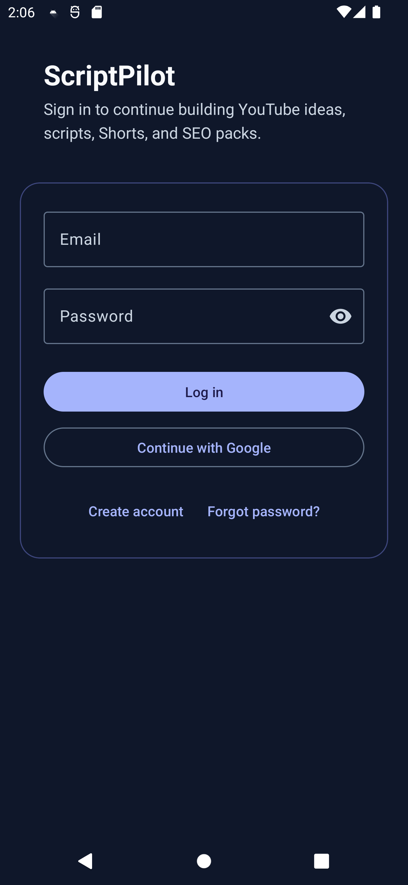 | 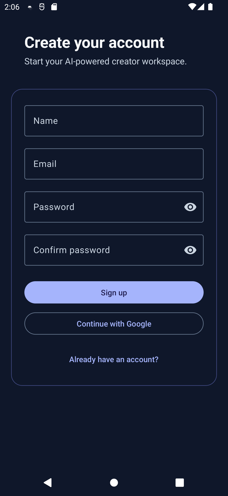 | 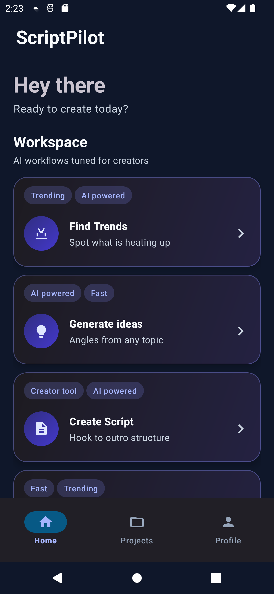 |

| Trends | Ideas | Script studio |
| --- | --- | --- |
| 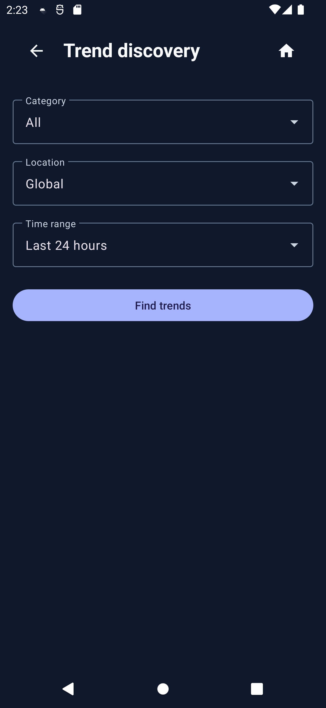 | 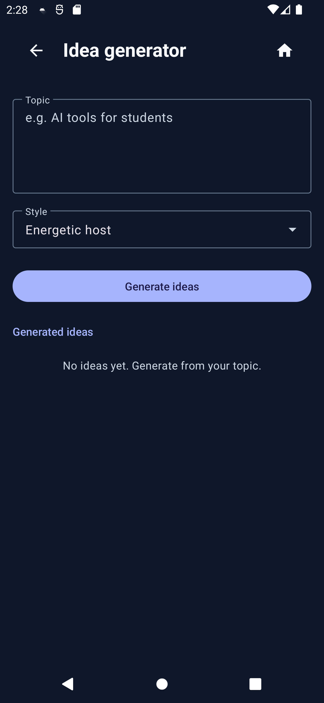 | 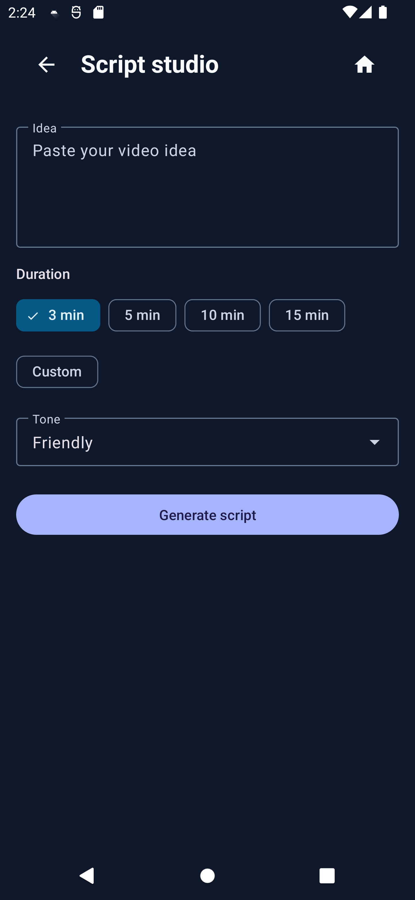 |

| Shorts mode | SEO assistant | Projects |
| --- | --- | --- |
| 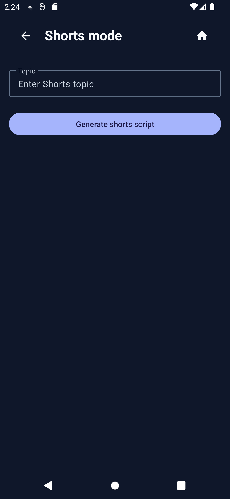 | 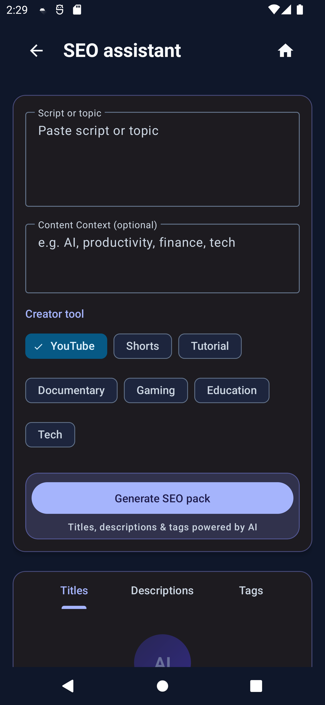 | 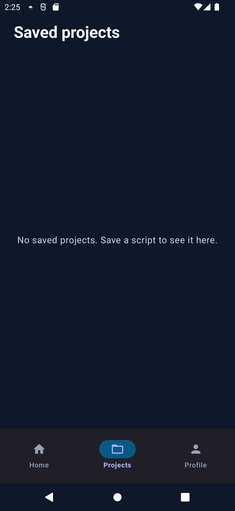 |

| Profile | Premium plans |
| --- | --- |
| 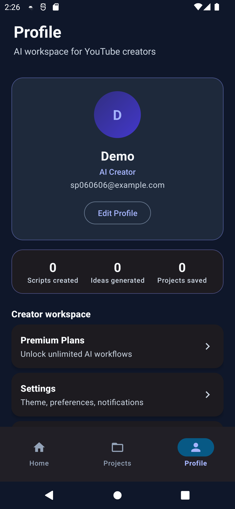 | 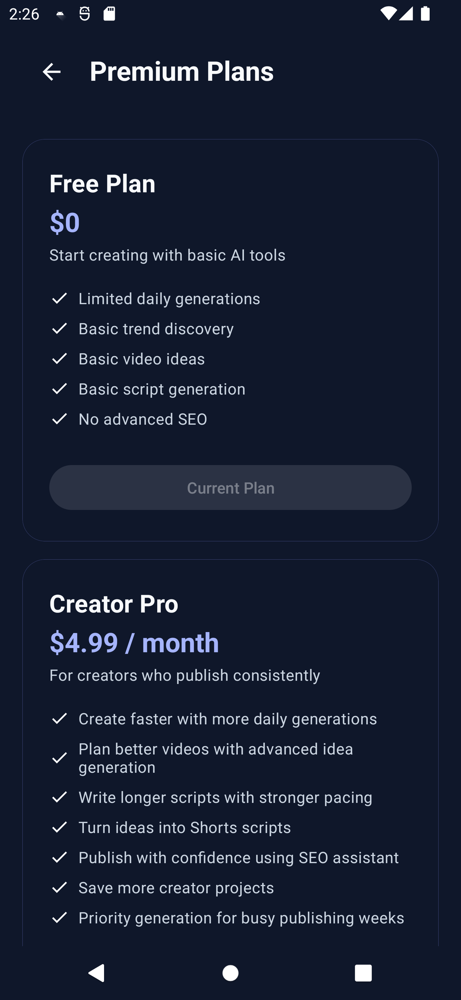 |

## Setup and Run

1. Clone the repository:

   ```bash
   git clone https://github.com/Doc-Mic/ScriptPilot.git
   cd ScriptPilot
   ```

2. Open the project in Android Studio.

3. Confirm the Android SDK path is configured in `local.properties`.

4. Add or verify Firebase configuration:

   - Place `google-services.json` in `app/` for your Firebase project.
   - Enable Firebase Authentication providers used by the app.
   - Do not commit private service credentials or backend secrets.

5. Build the debug APK:

   ```bash
   ./gradlew :app:assembleDebug
   ```

6. Run the app on an Android emulator or connected Android device from Android Studio, or install the debug APK:

   ```bash
   adb install -r app/build/outputs/apk/debug/app-debug.apk
   ```

## Current Status

ScriptPilot is in active development. The latest local emulator run successfully launched the app, completed sign-up with a disposable test account, and captured the screenshots shown above.

## Developer

Developed by Irfan Cheema.
