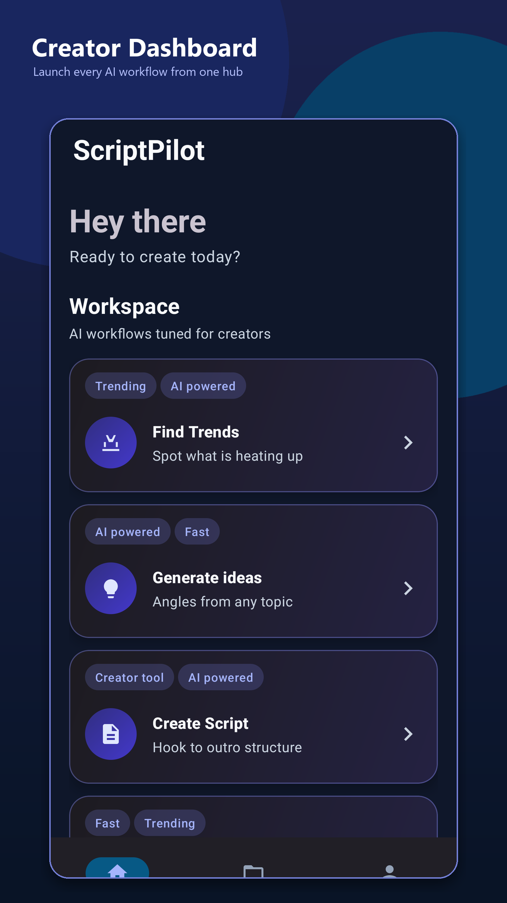
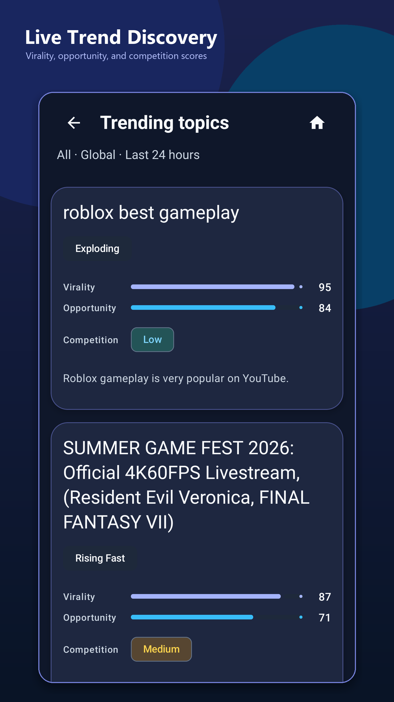
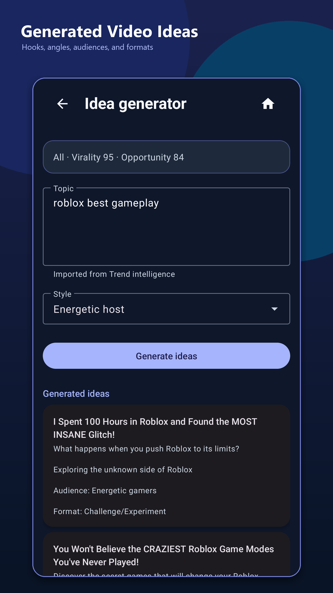
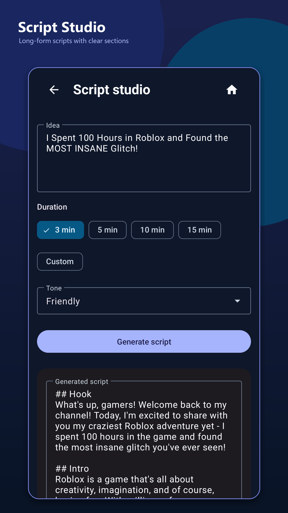
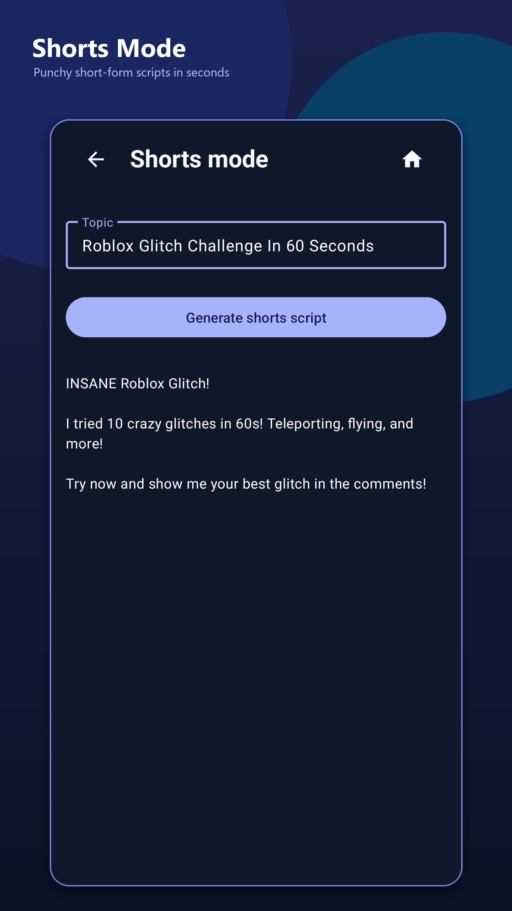
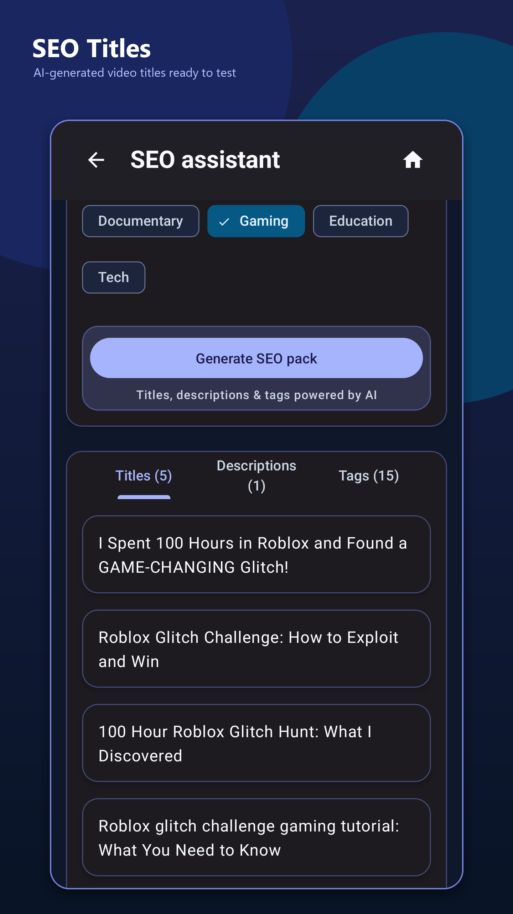
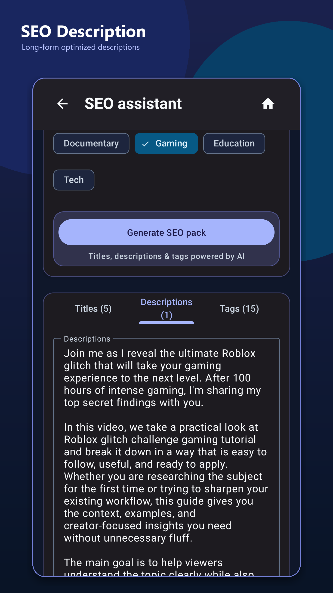
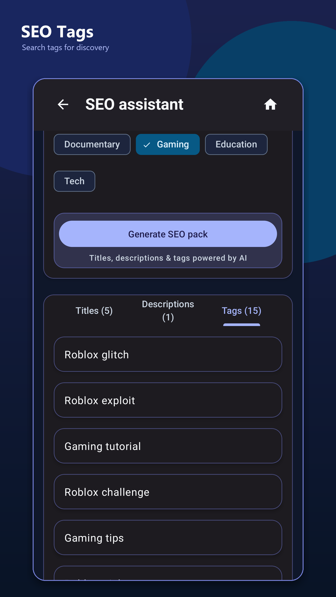
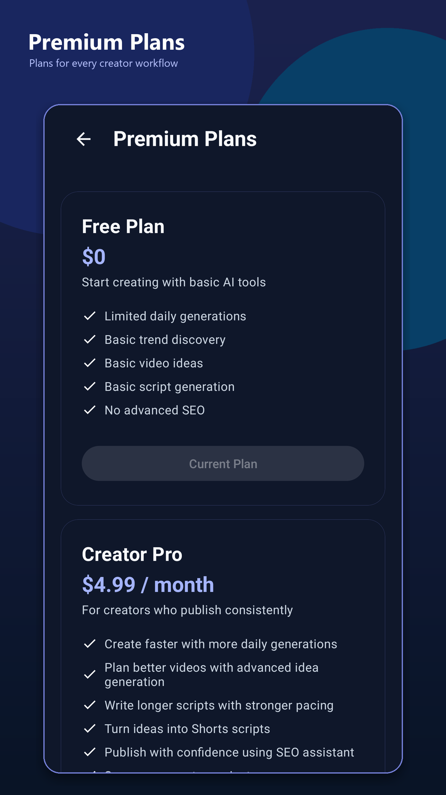
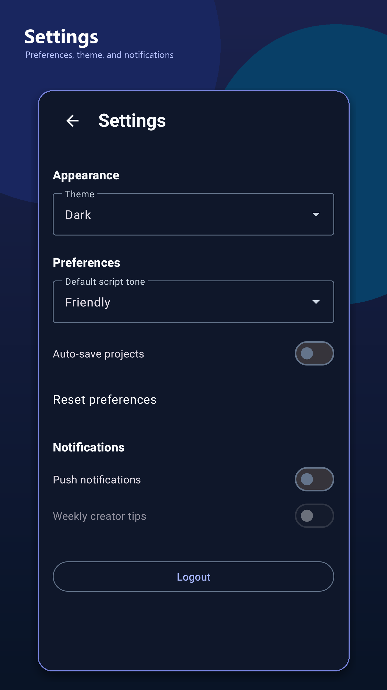

# ScriptPilot


ScriptPilot is an AI-powered Android workspace for YouTube creators. It helps creators discover trends, generate video ideas, draft long-form scripts, create Shorts concepts, prepare SEO packs, and manage creator projects from one mobile app.

## Download from Google Play

Install ScriptPilot on Android:

[](https://play.google.com/store/apps/details?id=com.mic.scriptpilot)

[Open ScriptPilot on Google Play](https://play.google.com/store/apps/details?id=com.mic.scriptpilot)

## App Overview

ScriptPilot turns a creator workflow into a guided mobile experience:

- Discover live trending topics with virality, opportunity, and competition signals.
- Turn trends or raw topics into multiple video ideas with hooks, angles, audiences, and formats.
- Generate long-form YouTube scripts with structured hook, intro, body, and outro sections.
- Create short-form scripts for Shorts and Reels-style content.
- Generate YouTube SEO titles, long descriptions, and tags from a script or topic.
- Track profile stats, preferences, premium plans, and saved creator work.

## Features

- Firebase email/password and Google sign-in
- Home dashboard with creator workflow shortcuts
- Trend discovery by category, location, and time range
- AI idea generator with tone/style controls
- Script Studio for structured video scripts
- Shorts Mode for fast short-form scripts
- SEO Assistant for titles, descriptions, tags, and content context
- Saved projects area for creator drafts
- Profile, settings, and premium plan screens
- Modern dark Material UI built for Android

## Screenshots Gallery

| Home | Trend Results |
| --- | --- |
|  |  |

| Ideas | Generated Script |
| --- | --- |
|  |  |

| Shorts Output | SEO Titles |
| --- | --- |
|  |  |

| SEO Description | SEO Tags |
| --- | --- |
|  |  |

| Premium Plans | Settings |
| --- | --- |
|  |  |

## Tech Stack

- Kotlin
- Android XML views with ViewBinding
- MVVM architecture
- Jetpack Navigation
- Hilt dependency injection
- Room persistence
- Retrofit and Gson
- Firebase Authentication
- Google Identity / Android Credential Manager
- Material Components
- Gradle Kotlin DSL

## Architecture Overview

ScriptPilot follows a conventional Android MVVM structure:

- `ui/` contains fragments, ViewModels, adapters, and common UI helpers.
- `domain/model/` contains app-facing models such as trends, ideas, scripts, projects, and SEO results.
- `data/repository/` coordinates local persistence, preferences, authentication, and API-backed generation.
- `data/remote/` contains Retrofit APIs, request/response models, and parsing helpers.
- `data/local/` contains Room database entities, DAO, and mapping.
- `di/` provides Hilt modules for repositories, networking, auth, and database wiring.

## Installation Instructions

These steps are for developer setup only. End users should install ScriptPilot from Google Play using the download link above.

1. Clone the repository:

   ```bash
   git clone https://github.com/Doc-Mic/ScriptPilot.git
   cd ScriptPilot
   ```

2. Open the project in Android Studio.

3. Confirm the Android SDK path is configured in `local.properties`.

4. Add or verify Firebase configuration:

   - Place `google-services.json` in `app/` for your Firebase project.
   - Enable the Firebase Authentication providers used by the app.
   - Do not commit private service credentials or backend secrets.

5. Build the debug APK:

   ```bash
   ./gradlew :app:assembleDebug
   ```

6. Run the app on an Android emulator or connected Android device from Android Studio, or install the debug APK:

   ```bash
   adb install -r app/build/outputs/apk/debug/app-debug.apk
   ```

## Developer

Developed by Irfan Cheema.
